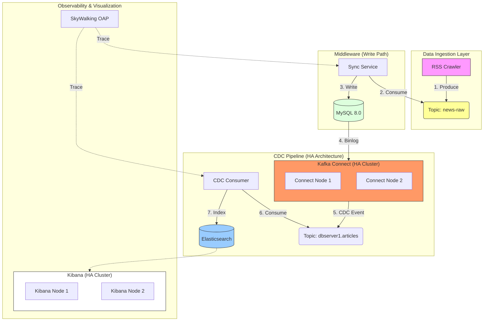

# Search Data Sync Platform (Principal Architect Edition)

A high-performance, **Event-Driven** search platform featuring **Change Data Capture (CDC)**, **Zero-Code Coupling**, and **Distributed Tracing**.

## Project Highlights

- **Event-Driven CDC**: Replaced dual-write with **Debezium + MySQL Binlog**, ensuring perfect eventual consistency without coupling business logic.
- **Observability**: Full-link distributed tracing with **Apache SkyWalking** to monitor request latency from API to Database.
- **Resilience**: Kafka buffering for write protection; standardized error handling.
- **Modern Stack**: Java 17, Spring Boot 3, MySQL 8, Elasticsearch 7, Docker, Vue.js 3.

## Architecture



## High Availability Topology
The platform supports scaling for reliability:
- **Kafka Connect**: Multiple workers (`connect`, `connect-2`) for fault-tolerant CDC streaming.
- **Kibana**: multiple instances (`kibana`, `kibana-2`) behind the load balancer (simulated).
- **Kafka**: Configured for distributed coordination (Zookeeper).

## System Requirements
- **Java 17+**
- **Docker & Docker Compose** (Allocates ~4GB RAM)
- **Python 3.8+**

## Quick Start Guide

### 1. Start Full Infrastructure
Launch the entire platform including Middleware, Frontend, Database, Message Queue, and Observability stack.

```bash
docker-compose up -d --build
```
*Wait ~30-60 seconds for services to initialize.*

### 2. Register CDC Connector
Tell Debezium to start monitoring the MySQL binary log and streaming changes to Kafka.

```bash
./register_connector.sh
```

### 3. Usage
**Frontend**: [http://localhost:3000](http://localhost:3000)
- Search for "java" or "architecture".
- View detailed summaries with HTML rendering.

**Observability (SkyWalking)**: [http://localhost:8088](http://localhost:8088)
- Login: `admin/admin`
- View distributed traces from `SearchController` -> `Kafka` -> `CdcConsumer`.

**Kibana**: [http://localhost:5601](http://localhost:5601)
- Inspect Elasticsearch indices (`articles`).

### 4. Run E2E Tests
Verify the entire pipeline (Producer -> DB -> CDC -> Search) works correctly.

```bash
pip3 install -r tests/requirements-test.txt
python3 tests/e2e_test.py
```

## API Reference

### Get Recent Articles
`GET /api/recent`
Returns the 10 most recently indexed articles from Elasticsearch.

### Search Articles
`GET /api/search?q={keyword}`
Returns articles matching the keyword with highlighting.

| Parameter | Description |
|-----------|-------------|
| `q`       | Search query (e.g., "java") |

## Future Architecture Evolution

### 1. Storage Backend: MySQL -> HBase
- **Current**: MySQL 8.0 (Good for <100M rows).
- **Future**: To scale to **PB-level**, migrating the "Source of Truth" to **HBase** (on Hadoop) is recommended. The CDC pattern (listening to WAL) remains the same.
