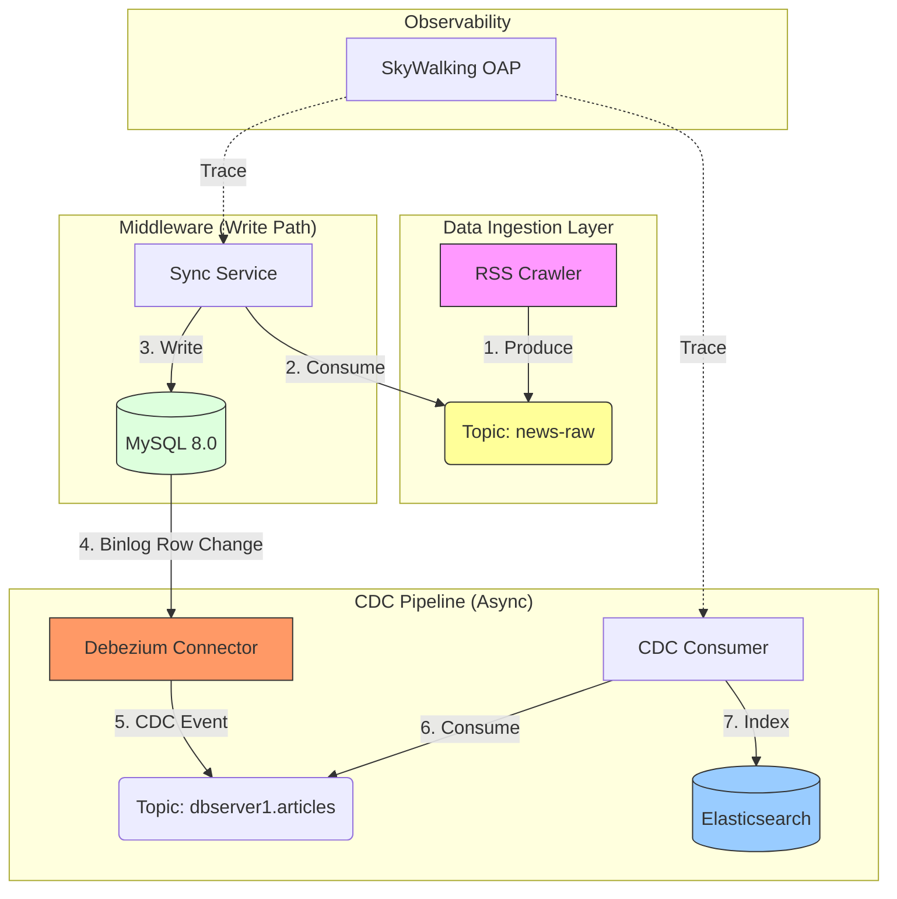

# Search Data Sync Platform (Principal Architect Edition)

A high-performance, **Event-Driven** search platform featuring **Change Data Capture (CDC)**, **Zero-Code Coupling**, and **Distributed Tracing**.

## Project Highlights

- **Event-Driven CDC**: Replaced dual-write with **Debezium + MySQL Binlog**, ensuring perfect eventual consistency without coupling business logic.
- **Observability**: Full-link distributed tracing with **Apache SkyWalking** to monitor request latency from API to Database.
- **Resilience**: Kafka buffering for write protection; standardized error handling.
- **Modern Stack**: Java 17, Spring Boot 3, MySQL 8, Elasticsearch 7, Docker, Vue.js 3.

## Architecture



## System Requirements
- **Java 17+**
- **Docker & Docker Compose** (Allocates ~4GB RAM)
- **Python 3.8+**

## Quick Start Guide

### 1. Start Infrastructure
Spin up MySQL, Kafka, Debezium, SkyWalking, and Elasticsearch.

```bash
docker-compose up -d
```
*Wait ~30 seconds for services to initialize.*

### 2. Register CDC Connector
Tell Debezium to start monitoring the MySQL binary log.

```bash
chmod +x register_connector.sh
./register_connector.sh
```

### 3. Setup Observability Agent
Download the SkyWalking Java Agent.

```bash
chmod +x setup_agent.sh
./setup_agent.sh
```

### 4. Run Middleware (With Tracing)
Start the Spring Boot application with the SkyWalking agent attached.

```bash
export SW_AGENT_NAME=search-middleware
export SW_AGENT_COLLECTOR_BACKEND_SERVICES=localhost:11800

mvn -f search-middleware/pom.xml spring-boot:run -Dspring-boot.run.jvmArguments="-javaagent:$(pwd)/skywalking-agent/skywalking-agent.jar"
```
> API: `http://localhost:8080/api`
> SkyWalking UI: `http://localhost:8088`

### 5. Run Data Crawler
Fetch RSS feeds and push to the pipeline.

```bash
pip3 install -r requirements.txt
python3 rss_crawler.py
```

### 6. Frontend
(Optional) Simple search UI.
```bash
cd search-frontend
python3 -m http.server 3000
```
Visit: `http://localhost:3000`

## API Reference

### Get Recent Articles
`GET /api/recent`
Returns the 10 most recently indexed articles from Elasticsearch.

### Search Articles
`GET /api/search?q={keyword}`
Returns articles matching the keyword with highlighting.

| Parameter | Description |
|-----------|-------------|
| `q`       | Search query (e.g., "java") |

## Future Architecture Evolution

### 1. Storage Backend: MySQL -> HBase
- **Current**: MySQL 8.0 (Good for <100M rows).
- **Future**: To scale to **PB-level**, migrating the "Source of Truth" to **HBase** (on Hadoop) is recommended. The CDC pattern (listening to WAL) remains the same.
