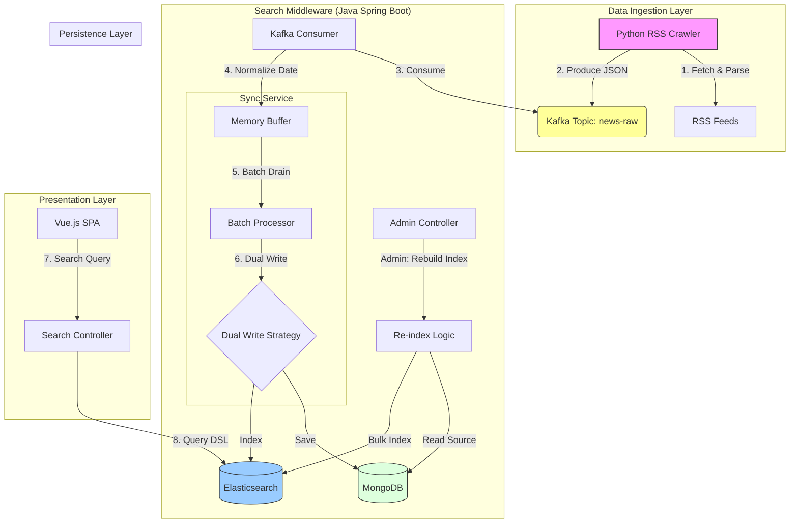

# Search Data Sync Platform

A high-performance middleware system that synchronizes external RSS data into a searchable index (Elasticsearch) and persistent storage (MongoDB), featuring a modern Vue.js search frontend.

## Project Highlights

- **Decoupled Architecture**: Using Kafka to buffer writes, protecting the search engine from traffic spikes (solving the "OOM" and "Tombstone" issues typical in direct-write architectures).
- **Dual-Write Consistency**: Implemented "Source of Truth" (MongoDB) + "Search View" (ES) pattern to ensure data integrity and re-indexability.
- **High Performance**: Custom batch processing logic in the middleware layer to optimize I/O throughput.

## Architecture



## System Requirements

- **Java 17+**
- **Python 3.8+**
- **Docker & Docker Compose**

## Quick Start Guide

### 1. Start Infrastructure (Docker)
Spin up Kafka, Zookeeper, Elasticsearch, Kibana, and MongoDB.

```bash
docker-compose up -d
```
> **Note**: Kafka is exposed on port **9094** to avoid conflicts.

### 2. Run Data Crawler
The Python crawler fetches RSS feeds (Hacker News) and pushes them to Kafka.

```bash
# Install dependencies
pip3 install -r requirements.txt

# Run crawler
python3 rss_crawler.py
```

### 3. Run Search Middleware
The Java backend processes the stream and exposes the Search API.

```bash
cd search-middleware
./mvnw spring-boot:run
```
> The API will be available at `http://localhost:8080/api`.

### 4. Run Search Frontend
A minimalist Vue.js interface to search the indexed data.

For strict CORS security, it's best to run this via a local server:

```bash
cd search-frontend
python3 -m http.server 3000
```
Then open **[http://localhost:3000](http://localhost:3000)** in your browser.

## API Reference

### Get Recent Articles
`GET /api/recent`
Returns the 10 most recently indexed articles.

### Search Articles
`GET /api/search?q={keyword}`
Returns articles matching the keyword with highlighting.

| Parameter | Description |
|-----------|-------------|
| `q`       | Search query (e.g., "java") |

## Troubleshooting

- **CORS Errors**: Ensure you have restarted the backend after any configuration changes. Running the frontend via `python3 -m http.server` resolves most file-system CORS issues.
- **No Data**: Check `rss_crawler.py` output. If it successfully sent messages, check the middleware logs for "Received message".
- **Kafka Connection**: Ensure `docker-compose` is running and port `9094` is accessible.

## Future Architecture Evolution

To transition from a "Middleware Demo" to a **PB-level Production System**, the following architectural upgrades are planned:

### 1. Storage Backend: MongoDB -> HBase
- **Reason**: While MongoDB is excellent for documents, **HBase** (on HDFS) provides superior write throughput and scalability for massive datasets (PB scale).
- **Design**: Use HBase as the permanent "Cold Store" and "Source of Truth". RowKeys will be designed based on `reverse_timestamp + article_id` to optimize for time-range scans.

### 2. Synchronization: Dual-Write -> Binlog CDC (Change Data Capture)
- **Reason**: The current "Dual-Write" strategy (Java code writing to both DB and ES) couples business logic with synchronization logic.
- **Design**:
    - **Step 1**: Business code only writes to the Primary DB (MySQL/HBase).
    - **Step 2**: A CDC component (e.g., **Canal** or **Flink CDC**) listens to the database logs (Binlog/WAL).
    - **Step 3**: Changes are streamed into Kafka -> Elasticsearch.
- **Benefit**: Zero code intrusion, lower latency, and guaranteed "at-least-once" delivery.
